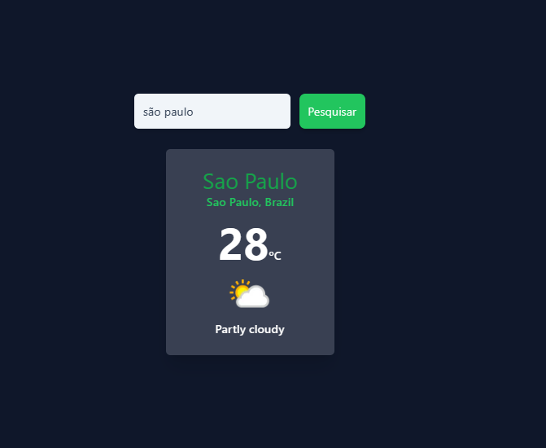

<h1 align="center">Weather App</h1>

  <a href="#-tecnologias">Tecnologias</a>&nbsp;&nbsp;&nbsp;|&nbsp;&nbsp;&nbsp;
  <a href="#-projeto">Projeto</a>&nbsp;&nbsp;&nbsp;|&nbsp;&nbsp;&nbsp;
  <a href="#-layout">Layout</a>

 

  

## 🚀 Tecnologias

Esse projeto foi desenvolvido com as seguintes tecnologias:

- JavaScript
- [ReactJS](https://reactjs.org/)
- [TailwindCSS](https://tailwindcss.com/)
- [Create React App](https://create-react-app.dev/)
- [Npm](https://www.npmjs.com/)

## 💻 Projeto

Projeto que traz informações climáticas do local desejado.

- [x] Informações em tempo real (clima, temperatura, umidade, etc)
- [x] Buscas por qualquer lugar do mundo.
